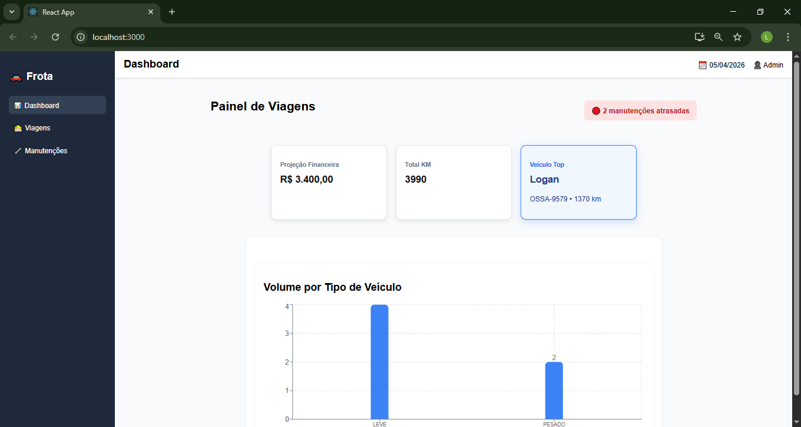
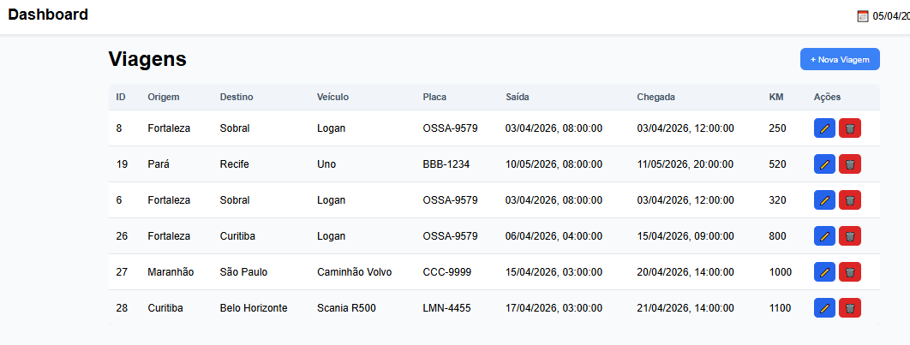
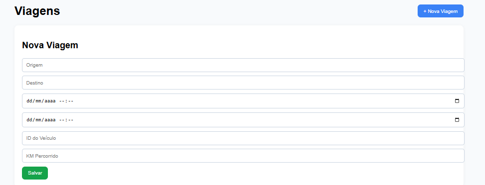
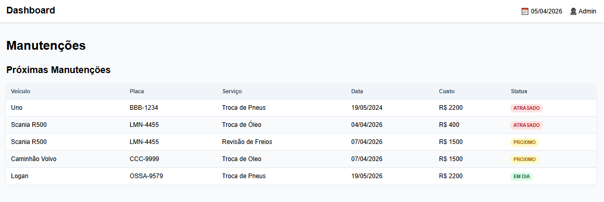

# 🚗 Sistema de Gestão de Frota

## 📌 Descrição

Este projeto consiste em um sistema de gestão de frota desenvolvido como desafio técnico, com foco no módulo de Viagens, permitindo o gerenciamento de deslocamentos e a visualização de métricas estratégicas através de um dashboard.

O sistema integra backend em Java com frontend moderno em React, oferecendo uma interface funcional e intuitiva.

## 🧠 Decisões Técnicas

Backend desenvolvido com Spring Boot
Arquitetura em camadas:
Controller
Service
Repository
Uso de JPA + Queries SQL nativas para métricas
Banco de dados relacional (PostgreSQL)
Frontend desenvolvido com React (SPA)
Consumo de API via Axios
Gráficos utilizando Recharts

## ⚙️ Tecnologias Utilizadas

- Backend
- Java 17
- Spring Boot 4.0.5
- Spring Data JPA
- Spring Web MVC
- PostgreSQL
- Frontend
- React 19
- React Router DOM
- Axios
- Recharts

## 📊 Métricas Implementadas

O sistema apresenta um dashboard com as seguintes métricas (todas baseadas em SQL):

- Total de KM percorrido
- Soma da quilometragem de todas as viagens.
- Volume por Categoria
- Quantidade de viagens agrupadas por tipo de veículo (LEVE / PESADO).
- Cronograma de Manutenção
- Listagem das próximas 5 manutenções, ordenadas por data.
- Ranking de Utilização
- Identificação do veículo com maior soma de quilometragem acumulada.
- Projeção Financeira
- Soma do custo estimado de manutenções no mês atual.

## 🗄️ Banco de Dados

Foi utilizado o script SQL fornecido no desafio, com as seguintes entidades:

Veículos
Viagens
Manutenções

Relacionamentos foram mantidos conforme o modelo original.

## 🚀 Como Executar o Projeto:

🔹 Backend

Pré-requisitos:

- Java 17
- Maven
- PostgreSQL

Passos:

- mvn spring-boot:run

🔹 Frontend

Pré-requisitos:

- Node.js

Passos:
 
- npm install
- npm start

## 📷 Demonstração

O sistema possui:

Dashboard com métricas
Gráfico de volume por tipo
CRUD completo de viagens
Tabela de manutenções com status dinâmico

(Inserir prints aqui)

### Dashboard

### Tela de Viagens

### Criar Viagem

### Manutenções

## 📈 Considerações

- O projeto foi desenvolvido com foco em:

- Separação de responsabilidades
- Clareza na organização de código
- Eficiência nas consultas SQL
- Interface funcional e moderna
